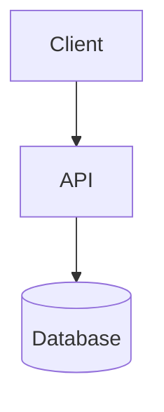

# Architecture Reviewer

Review the current project's architecture against system design principles.

## Step 0: Gather Context

Before auto-scanning, ask the user 2-4 questions using `AskUserQuestion` tool to focus the review:

| Question | Why |
|----------|-----|
| "What's your current/expected scale? (DAU, QPS, data size)" | Calibrates scalability recommendations |
| "What are your top concerns? (performance, reliability, security, cost)" | Prioritizes findings |
| "Any planned changes? (scale increase, new features, migration)" | Focuses forward-looking advice |
| "What's your SLA target? (availability %, latency p99)" | Sets the benchmark for evaluation |

**Skip if:** User says "just scan it" or provides context in the prompt.

## Auto-Scan Process

1. **Discover project type** — read package.json, docker-compose.yml, Dockerfile, go.mod, requirements.txt, Makefile, or similar config files
2. **Classify project** — backend API, frontend SPA, static site, full-stack, microservices, CLI tool. Adapt checklist to project type (skip irrelevant dimensions, mark as N/A).
3. **Identify architecture** — scan for API routes, database configs, cache configs, queue configs, service definitions, build configs, deployment configs
4. **Map components** — list discovered services, databases, caches, queues, external dependencies

## Review Checklist

Evaluate against these dimensions. Load references as needed from the `references/` directory (12 files covering fundamentals, DNS, caching, databases, queues, architecture patterns, case studies, modern systems, search, real-time, storage, and specialized systems).

### Scalability
Reference: [fundamentals-and-estimation.md](references/fundamentals-and-estimation.md)
- [ ] Stateless application servers?
- [ ] Database scaling strategy (replicas, sharding)?
- [ ] Caching layer present for read-heavy paths?
- [ ] Async processing for write-heavy/long-running tasks?

### Reliability
Reference: [architecture-patterns.md](references/architecture-patterns.md)
- [ ] Single points of failure identified?
- [ ] Circuit breaker / retry with backoff for external calls?
- [ ] Graceful degradation under load?
- [ ] Health checks (readiness, liveness)?

### Data Architecture
Reference: [databases.md](references/databases.md)
- [ ] Appropriate database choice for access patterns?
- [ ] Indexing strategy covers hot queries?
- [ ] Replication / backup strategy?
- [ ] Data model matches query patterns (avoid N+1)?

### Communication
Reference: [queues-and-protocols.md](references/queues-and-protocols.md)
- [ ] Appropriate protocol per use case (REST/gRPC/WebSocket)?
- [ ] Async where synchronous is unnecessary?
- [ ] Idempotency for non-safe operations?

### Security
Reference: [architecture-patterns.md](references/architecture-patterns.md)
- [ ] AuthN/AuthZ implemented?
- [ ] Rate limiting on public endpoints?
- [ ] Input validation at boundaries?
- [ ] Secrets in environment, not code?

### Observability
- [ ] Structured logging?
- [ ] Metrics collection (latency, error rate, throughput)?
- [ ] Distributed tracing for multi-service?

## Output Format

```
## Architecture Review: [Project Name]

### Components Discovered
[Auto-scanned component list]

### Findings

| # | Category | Severity | Finding | Recommendation |
|---|----------|----------|---------|----------------|
| 1 | ... | Critical/High/Medium/Low | ... | ... |

### Current Architecture Diagram
[Mermaid diagram of discovered components and their relationships]


### Summary
- **Strengths:** [What's done well]
- **Top 3 Improvements:** [Prioritized recommendations]
- **Architecture Score:** [X/10 with justification]
```

## Source

Principles from [The Engineer's Handbook](https://bachdx-learning-hub.vercel.app/).
