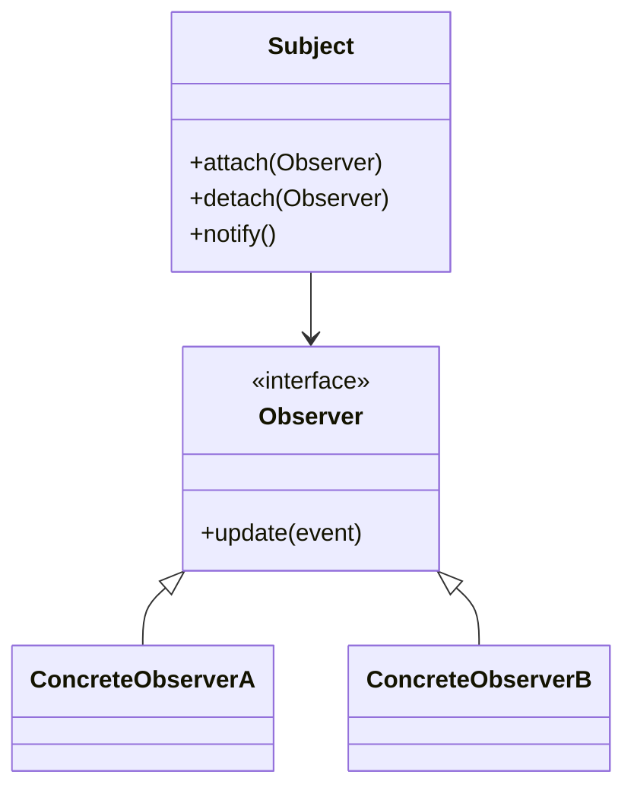

# Pattern Implementation Guide

Generate actionable implementation plans for applying design patterns to real problems.

## Step 0: Clarify Requirements (always ask)

Use `AskUserQuestion` tool to ask 2-4 questions before generating a plan:

| Question | Why |
|----------|-----|
| "What language/framework?" | Generates idiomatic code examples |
| "What specific problem needs solving?" | Ensures correct pattern selection |
| "Any constraints? (existing interfaces, performance, team familiarity)" | Avoids incompatible recommendations |
| "Is this greenfield or refactoring existing code?" | Determines migration complexity |

## Implementation Framework

### Phase 1: Problem Analysis
- Identify the core problem (creation, structure, behavior, distribution)
- List current pain points (tight coupling, duplication, complexity)
- Load relevant reference from `references/` directory based on pattern category

### Phase 2: Pattern Selection
- Map problem to pattern category using the routing table below
- Compare 2-3 candidate patterns in a trade-off table
- Justify final selection

### Phase 3: Mermaid Diagram (Required)
Always generate a class or component diagram before writing code:



### Phase 4: Implementation Steps
Numbered, actionable steps:
1. Define interfaces/abstractions
2. Implement concrete types
3. Wire dependencies (DI / factory)
4. Add error handling and edge cases
5. Write tests (unit per component, integration for collaboration)

### Phase 5: Code Examples
Provide minimal, idiomatic code snippets in the user's language showing:
- Core interface/abstract class
- One concrete implementation
- Usage example (wiring + invocation)

## Pattern Routing

| Problem | Pattern(s) | Reference |
|---------|-----------|-----------|
| Object creation complexity | Factory, Builder, Abstract Factory | [creational-patterns.md](references/creational-patterns.md) |
| Structural adaptation / wrapping | Adapter, Decorator, Proxy, Facade | [structural-patterns.md](references/structural-patterns.md) |
| Runtime behavior switching | Strategy, State, Command | [behavioral-patterns.md](references/behavioral-patterns.md) |
| Event-driven decoupling | Observer, Mediator, Event Bus | [behavioral-patterns.md](references/behavioral-patterns.md) |
| Distributed transactions | Saga, Outbox, 2PC | [distributed-patterns.md](references/distributed-patterns.md) |
| Read/write separation | CQRS, Event Sourcing | [distributed-patterns.md](references/distributed-patterns.md) |
| Resilience | Circuit Breaker, Retry, Bulkhead | [distributed-patterns.md](references/distributed-patterns.md) |
| Modern / idiomatic | Functional options, DI, Plugin | [modern-patterns.md](references/modern-patterns.md) |

## Output Format

```
## Implementation Plan: [Pattern] for [Problem]

### Pattern Selected: [Name]
**Rationale:** [Why this pattern fits]

### Component Diagram
[Mermaid diagram]

### Implementation Steps
1. ...
2. ...

### Code Examples
[Language-specific snippets]

### Tests to Write
- Unit: [list]
- Integration: [list]
```
